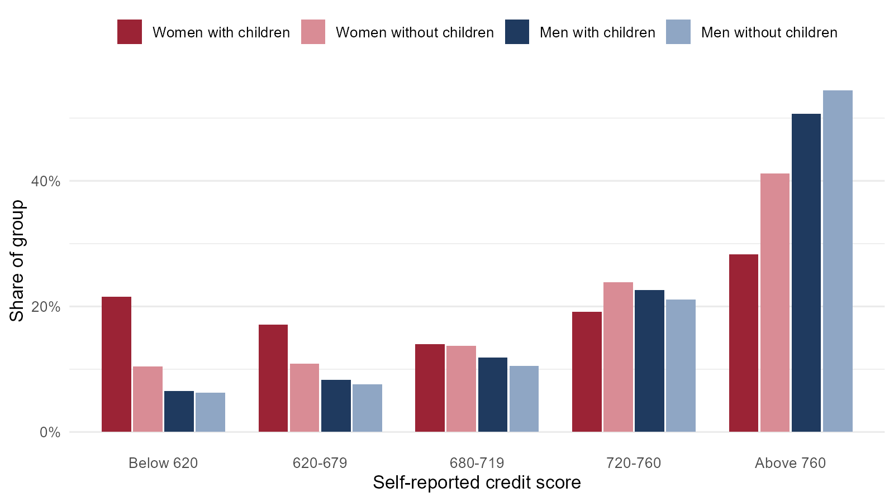
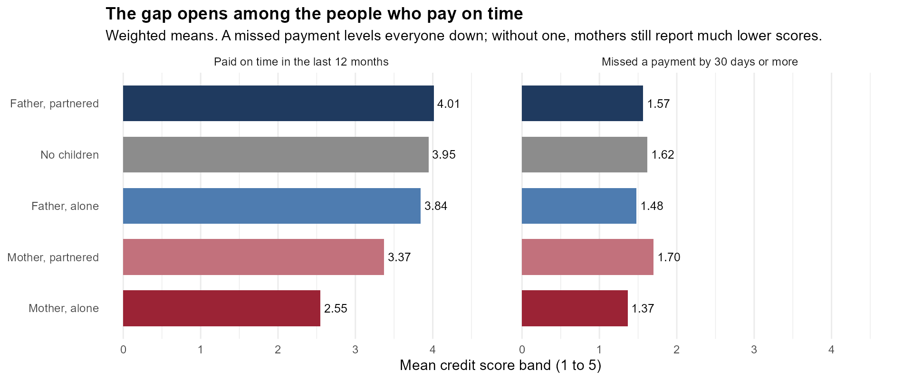
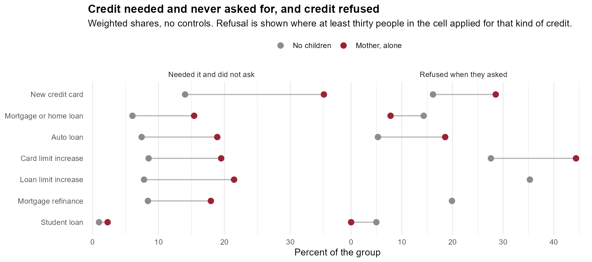

# Credit scores, gender and motherhood

An exploratory project on the child penalty in access to credit, using the Survey of Consumer Expectations of the Federal Reserve Bank of New York. It extends my undergraduate thesis at Universidad de Buenos Aires, *Credit Gaps and Motherhood: Unraveling Gender Disparities in Financial Access* (2024). The project is on hold while I finish my M.A. thesis; what is here is a clean version of the data work, a set of descriptive regressions, and a first attempt at locating the gap inside the credit file.

## Question

The child penalty in the labor market is well documented. Much less is known about credit, even though a credit score determines whether a household can borrow, and at what price, to smooth spending on health, education and housing, which is when children make borrowing most valuable.

The project started from a simple comparison: whether mothers report lower scores than fathers and than women without children, and whether living with a partner offsets the difference. The answer to the first is yes, and the gap between a mother and a father raising children alone survives income, homeownership, education, employment, race, state and year.

What changed the question is where that gap turns out to sit. A credit score is built mostly out of two things, the record of past payments and the share of the available limit that is being used, and the gap is not in the first of them. Mothers and fathers raising children alone miss payments at almost the same rate, and the difference between them is nearly twice as large among the respondents who paid everything on time. It is the second component that moves: among people servicing their debt without a late payment, mothers are far more likely to be at the limit of a credit card, and that one variable absorbs a third of the score gap.

So the working hypothesis is now about revolving use rather than default. Motherhood does not seem to push households into missing payments; it pushes them into carrying a balance they do not pay down. Motivation, hypotheses and related literature are in [docs/project_outline.md](docs/project_outline.md).

## Data

The Survey of Consumer Expectations (SCE) is a monthly rotating panel of about 1,300 U.S. household heads, who stay in the panel for up to twelve months. I use the core survey for 2013-2019 and the Credit Access module, which is fielded every four months and since February 2014 asks respondents for their credit score in five bands: below 620, 620-679, 680-719, 720-760 and above 760. Demographics and household composition come from each respondent's first interview.

The unit of observation is a person-year. The analysis sample has 11,393 observations from 8,580 respondents between 2014 and 2019. The microdata are public but are not redistributed here; [data/README.md](data/README.md) explains how to get them.

## Preliminary results



Among women with children under 18 at home, 22% report a score below 620 and 28% a score above 760. Among men with children the shares are 7% and 51%.

Everything below is weighted with the survey weight of the credit module and clustered by respondent. The weights matter little: the gender gap is 0.169 of a band weighted and 0.180 unweighted, so the result is not an artifact of who answers the survey.

### The hypothesis the project started from

A mother raising children on her own should report a lower score than a father doing the same, and a partner should soften the difference. Gender and partnership are crossed into one variable so that each family type is measured against the same reference, respondents without children, and the comparison that matters is a difference between two coefficients rather than a sum of three.

| Against respondents without children | Raw | + income | + controls | + state and year |
|:---|---:|---:|---:|---:|
| Father, partnered | 0.073 (0.061) | -0.313*** (0.056) | -0.136*** (0.053) | -0.139*** (0.052) |
| Father, alone | -0.577** (0.252) | -0.491** (0.216) | -0.231 (0.194) | -0.201 (0.178) |
| Mother, partnered | -0.746*** (0.072) | -0.896*** (0.058) | -0.522*** (0.058) | -0.515*** (0.057) |
| Mother, alone | -1.58*** (0.092) | -1.12*** (0.089) | -0.580*** (0.079) | -0.574*** (0.077) |
| Observations | 11,387 | 11,323 | 11,117 | 11,106 |

In the full specification a mother raising children alone reports **0.373 of a band less than a father in the same situation** (standard error 0.189, p = 0.049). Fathers raising children alone are not distinguishable from people without children once income, homeownership and the rest are held fixed; mothers are, whether they have a partner or not.

A partner turns out to matter less than it looks. Raw, one is worth most of a band to a mother, 1.58 against 0.746; with income and homeownership in the regression the two are almost the same, 0.574 against 0.515. What looks like the effect of a partner is mostly the income and the home that come with one.

An ordered logit, which estimates the cut points instead of assuming the bands are equally spaced, gives the same ordering: mother alone -1.464, mother partnered -1.229, father alone -0.656, father partnered -0.466 ([reg_ordered_logit](output/tables/reg_ordered_logit.md)).

### What does not matter

Among parents, neither the number of children nor the age of the youngest moves the score. A second child is worth -0.008 of a band (standard error 0.034) and having the youngest under six is worth 0.039 (0.093), both indistinguishable from zero, and neither interacts with gender ([reg_children_dose](output/tables/reg_children_dose.md)). The penalty attaches to being a mother, not to how many children there are or how much care they currently need. Among parents alone the gender gap is 0.39 of a band, larger than in the full sample.

### Where the gap comes from

Nothing above looks like a household that is simply short of money this month: the gap does not grow with the number of children and does not grow when the youngest is a toddler. [05_mechanism.R](code/05_mechanism.R) splits it the way a score is built instead.



**Missed payments are not the channel.** Mothers and fathers raising children alone are late on a loan payment at almost the same rate, 20.9% and 21.1%, against 5.3% among respondents without children, and yet they report very different scores. If the gap ran through payment history it should close among the respondents who paid everything on time. It widens. Restricted to them, a mother raising children alone reports 0.663 of a band less than a father doing the same (standard error 0.183, p < 0.001), against 0.373 in the whole sample ([mech_delinquency](output/tables/mech_delinquency.md), [mech_gap_clean_payers](output/tables/mech_gap_clean_payers.md)).

**The balance carried is.** Among cardholders who paid on time, 35.5% of mothers raising children alone had hit the limit of a credit card during the year, against 14.1% of respondents without children and 7.2% of fathers raising children alone. With income, homeownership, education, employment, race, state and year held fixed the difference is 10 percentage points (standard error 0.040). It is not about having a card in the first place: with the same controls, mothers raising children alone are no less likely to hold one ([mech_at_limit](output/tables/mech_at_limit.md)).

Putting that single variable into the score regression absorbs a third of the gap, from 0.609 to 0.409 of a band for mothers alone and from 0.441 to 0.338 for mothers with a partner ([mech_absorbed](output/tables/mech_absorbed.md)). Being at the limit is an outcome, so this is accounting: it says where the gap sits, not what put it there.

**Not the application stage either.** Mothers raising children alone apply for credit more often than respondents without children, by 9.6 percentage points, and are no more likely to be rejected once they do ([mech_access](output/tables/mech_access.md)). The gap is in the terms of the credit they already carry, not in being turned away at the door.

**What this points to.** The two components leave different kinds of mark. A missed payment records something that went wrong, and it ages off the file. A high balance against the limit is mechanical and contemporaneous: it lowers the score while the balance is there, the lower score raises the price of credit and lowers the limit, and a lower limit raises the ratio again at the same balance. The penalty lasts as long as the borrowing does, without anything having gone wrong. It is also what one would expect if the labor market child penalty is what drives this, since earnings fall around a birth at the point when spending on housing and childcare is least postponable, and the card is what absorbs the difference.

### What is rationed, and what there is to fall back on

Utilization is a ratio and none of the above says which side of it moves. The survey never asks for the credit limit, so the denominator cannot be measured, but three things around it can ([06_credit_constraints.R](code/06_credit_constraints.R)).

**Where the ceiling is.** Among cardholders who paid on time, the median balance of someone who reports having reached the limit is $5,000 for a mother raising children alone, $8,000 for a respondent without children and $15,500 for a partnered father ([con_balance](output/tables/con_balance.md)). Hitting the ceiling while owing less is what a lower ceiling looks like.

**Credit that is needed and never asked for.** For each kind of credit the module asks not only whether the respondent applied and how it ended, but whether they needed it and did not apply because they expected to be turned down. On that second question mothers raising children alone are above respondents without children for all seven kinds: 35% against 14% for a credit card, 20% against 9% for an increase in a card limit, 15% against 6% for a mortgage ([con_rationing](output/tables/con_rationing.md)). They ask for a limit increase more than twice as often, 25% against 11%, and are refused 44% of the time against 28%. These are raw shares; with income and homeownership in the regression the asking survives and the refusal gap does not ([con_card_margin](output/tables/con_card_margin.md)), so read the panel as a description of who is constrained rather than as evidence about how lenders behave.




**What the household has to fall back on.** Respondents give the percent chance of needing $2,000 for an unexpected expense in the next month, and the percent chance of being able to come up with it. Mothers raising children alone put the first at 30.5%, the lowest of any family type, and the second at 38.9%, against 72.6% for respondents without children. With income, homeownership, education, employment, race, state and year held fixed, the gap in being able to raise the money is 9.5 points for mothers alone and 9.9 for mothers with a partner, both precisely estimated, while the gap in expecting to need it is zero ([con_buffer](output/tables/con_buffer.md)). At the same income they also have about 2 points less of their budget going to anything discretionary.

The same exposure to a shock, half the capacity to absorb one, and less left over to cut. The card is what remains, which is a reason for a balance that does not come down.

**The pessimism is warranted.** Respondents also give the percent chance that a request of theirs would be granted. Raw, mothers raising children alone put a new card application at 48% against 77% for respondents without children. Holding the score band they report fixed, the difference is -1.2 (2.9) for a card and +2.6 (3.3) for a limit increase ([con_expectations](output/tables/con_expectations.md)). Their expectations track their own record, so what looks like discouragement is an accurate reading of a low score rather than something added on top of it. Mothers with a partner are the exception: they stay 4.6 points below what their band implies.

**What they expect of themselves.** The core survey asks everyone for the percent chance that they will not be able to make one of their debt payments over the next three months. Mothers raising children alone put it at 27.6%, against 14.4% for fathers raising children alone, who were late over the past year at the same rate, 21.1% against 20.9% ([con_own_risk](output/tables/con_own_risk.md)). About half of that gap is the score band they report and the rest is imprecisely estimated, but the two kinds of expectation clearly do not behave alike: what a lender will do with them tracks their record, and what they think will happen to them looks more like the buffer than like the record. Neither numeracy, scored from the arithmetic questions the survey puts to respondents new to the panel, nor willingness to take financial risks accounts for any of this, and putting both into the regression leaves the gap in reaching the card limit where it was.

### Race

Black respondents report scores between 0.6 and 0.95 of a band lower than the rest, depending on the controls, with a further and less precisely estimated difference for Black women ([reg_race](output/tables/reg_race.md)).

### How to read all of this

These are associations. Fertility and partnership are choices correlated with many things that also move credit histories, so nothing here identifies the effect of having a child, and household composition is measured at each respondent's first interview and carried forward.

Two things are worth knowing before leaning on any single number. The score is self-reported in five bands, although mothers raising children alone are the group that checked it most recently, 72% within six months against 62% of respondents without children, so if anything their answer is the better informed one. And there are 110 person-years of fathers raising children alone, against 468 of mothers, so the comparison the design is built around is the least precisely estimated one in the table: the robust statement is the one against respondents without children.

## What this would add

The child penalty in earnings and employment is well measured. Gender differences in credit have been studied mostly on the extensive margin, on who is approved, at what limit and at what rate, and the credit score itself has been studied mainly for what it does to people, in employment screening and in insurance pricing, and for the racial gaps in it. The gap between what a mother and a father with the same household earn is documented; the gap between what their credit files look like is not.

Three things would be new. The first is measuring the child penalty in the credit record rather than in earnings: earnings recover in part after a birth, while a credit file is a stock, so the same shock is carried forward into the price of future borrowing long after the earnings dip has closed. The second is splitting the gap into the components a score is built from, because a penalty for failing to pay and a penalty for borrowing are different objects with different remedies: rules that age derogatory marks off a file do nothing about the second, while a higher limit does. The third is the comparison between mothers and fathers raising children alone, which holds the household structure fixed and varies the gender of the parent, and is a cleaner comparison than the usual one between people with and without children.

Doing this properly needs better data than a self-reported band and a yes or no about hitting a limit. The natural next step is a credit bureau panel, where the balance and the limit are both observed and the components of the file can be seen directly, with an event study around a first birth. What the SCE can do is say what to look for.

## Next steps

- **The limit itself.** Everything above infers it. A credit bureau panel measures it, along with the balance, and turns the indicator for hitting the ceiling into a ratio.
- **Whether it lasts.** A third of respondents are seen in two years, so the same person can be followed from one to the next: who is still at the limit, and whether a limit cut in one year predicts being at the ceiling in the following one.
- **The mortgage margin.** Mothers raising children alone apply for a mortgage less often than anyone and report needing one and not asking more often than anyone. Staying out of the market that builds equity is a different penalty from a high card balance, and it is the one with consequences for wealth rather than for the price of credit.
- **Who is answering for the household.** Mothers living with a partner are the least likely of any group to make the household's financial decisions, 29% against 39% of partnered fathers, and they are also the only group whose expectations of being approved sit below what their score band implies. Whether a respondent is describing a credit record they manage is a question the survey can answer and this code does not use yet.
- **Policy.** The Medicaid expansion of 2014 as a source of variation in the financial cost of health shocks, with the state identifier already in the sample. If the mechanism is the balance and not the missed payment, the expansion should show up in how much of the limit is used before it shows up in delinquency.

## Repository

```
code/
  00_config.R            paths
  01_build_sample.R      raw files -> one record per person and year
  02_analysis_sample.R   sample restriction and variable construction
  03_descriptives.R      summary table and figure
  04_regressions.R       regression tables (markdown and LaTeX), weighted
  05_mechanism.R         payment history against balances: where the gap sits
  06_credit_constraints.R what is rationed, and what the household can fall back on
  utils.R                table helpers
data/README.md           how to obtain the microdata
docs/project_outline.md  motivation, hypotheses, literature
output/                  tables and figures produced by the code
```

The code runs in R 4.5 with `dplyr`, `tidyr`, `readxl`, `ggplot2`, `fixest`, `MASS` and `sandwich`. Put the four raw files in `data/raw` (or point `SCE_DATA_DIR` to them) and run the scripts in order from the repository root.

María Luján Puchot
